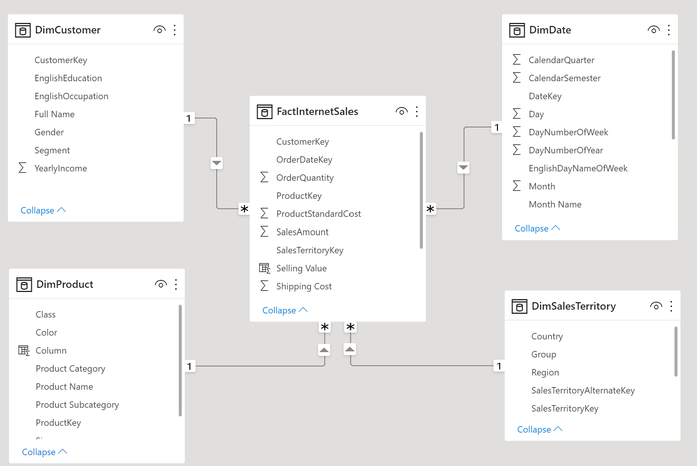
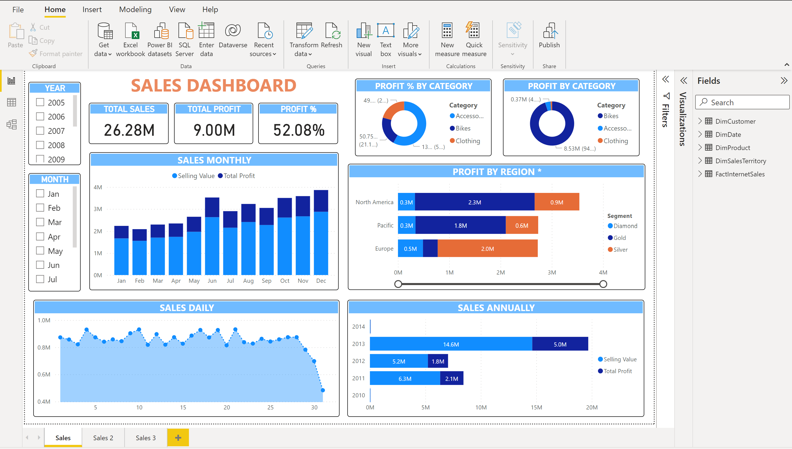
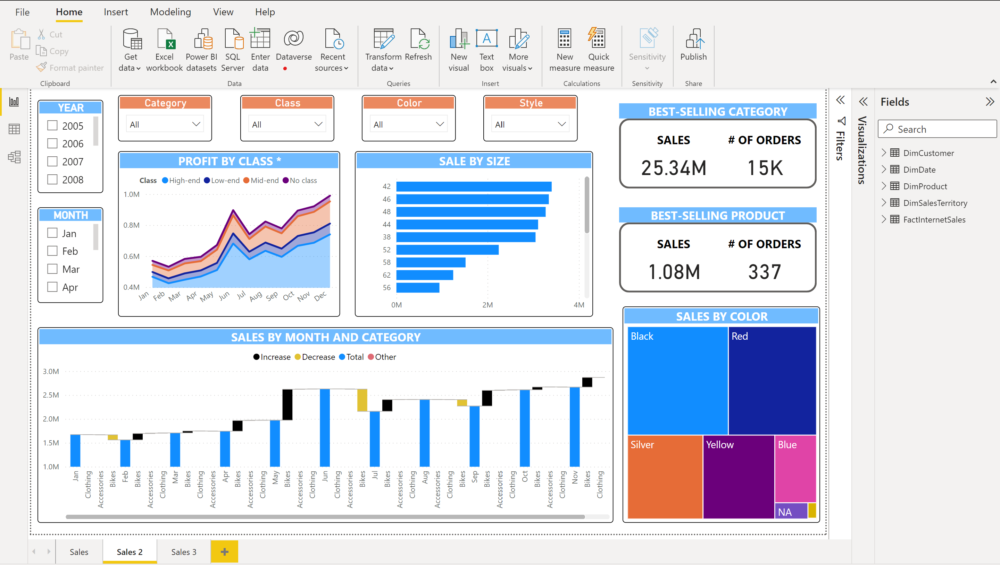
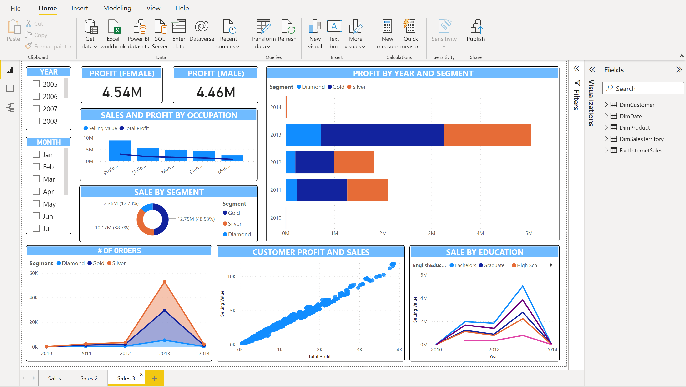

# Simple visualization using PowerBI

This is my final exam assignment from my time in university. 
- Data used by PowerBI is extracted from [AdventureWorksDW2019](https://learn.microsoft.com/en-us/sql/samples/adventureworks-install-configure?view=sql-server-ver16&tabs=ssms) and stored in SQL Server. 
- Data model: Star schema

